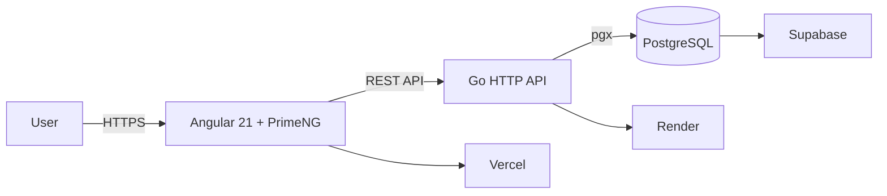

# Senshi Training Planner

<p align="center">
  
</p>

<p align="center">
  <strong>Full-stack training management platform for Senshi Kickboxing.</strong><br>
  Workout planning, scheduling, student management, execution tracking and training history.
</p>

<p align="center">
  <a href="https://senshi-training-planner.vercel.app"><strong>Open live application</strong></a>
</p>

<p align="center">
  
  
  
  
  
  
</p>

## Overview

Senshi Training Planner is a production-deployed web application designed to organize the operational workflow of martial arts training sessions.

The system supports the full training lifecycle:

| Area | Capabilities |
| --- | --- |
| Training design | Categories, reusable blocks and workout composition |
| Scheduling | Training agenda and completion workflow |
| People | Student management and professor administration |
| History | Immutable records of completed training sessions |
| Security | Authentication, roles and server-side session control |

## Architecture



### Production

| Layer | Platform |
| --- | --- |
| Frontend | Vercel |
| Backend | Render |
| Database | PostgreSQL on Supabase |

The frontend never connects directly to PostgreSQL or Supabase. Database access is restricted to the Go backend.

## Tech stack

<p>
  
  
  
  
  
  
  
</p>

### Backend

- Go
- `net/http`
- PostgreSQL
- pgx
- golang-migrate
- Argon2id password hashing
- opaque server-side sessions

### Frontend

- Angular 21
- TypeScript
- PrimeNG
- PrimeIcons
- RxJS
- Vitest
- Playwright

### Delivery

- GitHub
- GitHub Actions
- Vercel
- Render
- Supabase

## Main features

- Secure login and logout
- ADMIN and PROFESSOR authorization model
- Professor account administration
- Student management
- Training categories
- Reusable training blocks
- Workout composition
- Training agenda
- Completion workflow
- Immutable historical records
- Responsive dark-mode UI

## Security design

Security-sensitive flows are implemented in the backend.

Highlights:

- passwords hashed with Argon2id;
- opaque session tokens instead of JWTs;
- raw session tokens are never persisted in the database;
- authentication cookies are `HttpOnly`;
- production authentication requires HTTPS and secure cookies;
- session invalidation is performed server-side;
- professor password reset or deactivation invalidates active sessions;
- login failures avoid exposing whether an account exists;
- PostgreSQL credentials are provided only through environment variables;
- the frontend has no direct database credentials.

The repository intentionally contains only example environment files. Real credentials and secrets must never be committed.

## Repository structure

```text
.
├── backend/
│   ├── cmd/
│   │   ├── server/
│   │   ├── migrate/
│   │   └── create-admin/
│   ├── internal/
│   │   ├── auth/
│   │   ├── blocks/
│   │   ├── categories/
│   │   ├── database/
│   │   ├── history/
│   │   ├── professors/
│   │   ├── schedule/
│   │   ├── students/
│   │   └── workouts/
│   └── migrations/
├── frontend/
│   ├── e2e/
│   └── src/app/
├── .github/
└── README.md
```

## Local development

### Requirements

- Go 1.25.11+
- Node.js compatible with Angular 21
- npm
- PostgreSQL

Clone the repository and create the local environment file:

```bash
cp .env.example .env
```

Configure:

```env
PORT=8080
APP_ENV=development
DATABASE_URL=postgres://...
```

### Backend

```bash
cd backend

set -a
source ../.env
set +a

go run ./cmd/migrate up
go run ./cmd/server
```

Health check:

```bash
curl http://localhost:8080/health
```

Expected response:

```json
{"status":"ok"}
```

### Frontend

```bash
cd frontend
npm ci
npm start
```

The Angular development proxy forwards `/api` requests to the local backend.

## Tests

### Backend

```bash
cd backend
go test ./...
```

### Frontend

```bash
cd frontend
npm ci
npm test
npm run build
```

### End-to-end

Playwright tests are available under `frontend/e2e`.

Mutable E2E tests must run only against an isolated test database.

```bash
cp .env.e2e.example .env.e2e.local
cd frontend
npm run e2e
```

## Database migrations

Versioned migrations are stored in `backend/migrations`.

```bash
cd backend

go run ./cmd/migrate status
go run ./cmd/migrate up
go run ./cmd/migrate down
```

Production database accounts should follow least-privilege principles.

## CI and security automation

GitHub Actions validates:

- Go tests;
- Go build;
- frontend dependency installation;
- Angular tests;
- production frontend build.

CodeQL analyzes Go and JavaScript/TypeScript. Dependency updates are tracked with Dependabot.

## Project status

**Production:** deployed and functional.

This repository is maintained as a public engineering portfolio project, emphasizing full-stack architecture, secure authentication, backend authorization, relational data modeling, automated testing, CI and production deployment.

## Security reports

If you identify a security issue, please follow the process described in [SECURITY.md](SECURITY.md).

## License

No open-source license is currently granted. Unless a license is added explicitly, all rights remain reserved by the repository owner.
